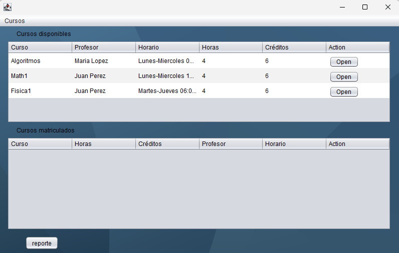
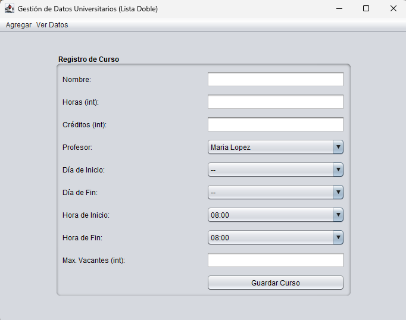

gestion de matricula

* Modelo:
    - Curso
        - String: name, profesor, horario
        - int: hours, credits, maxVacantes, vacantesDisponibles
        - constructor, getters, setters
    - Alumno
        - String: CODIGO, PASSWD
        - constructor, getters, setters
    - Docente
        - String: nombre, pwd
        - constructor, getters, setters

* Structure
    ### generics: para usar diferentes tipos
    - genericNode
        - private T dato;
        - private genericNode<T>: previo, siguiente;
        - constructor, getters, setters
    - genericListaDoble
        - genericNode<T>: cabeza, cola
        - metodos: insertarAlInicio, buscarStudent, eliminar*, toArray, obtenerDatosComoString
        - globalVariables: inicia variables estaticas (para no instanciarlas nuevaamente)
    - globalVariables: declarar/añadir datos
* UI:
    - frmLogin: se globalVariables para añadir algunos datos a las listas
        - frmAdd: añadir nuevos Cursos, Docente, Alumno a las listas
        - Principal: seleccionar cursos a matricular
            - frmConfirm: confirmar matricula

   
   
   
   
